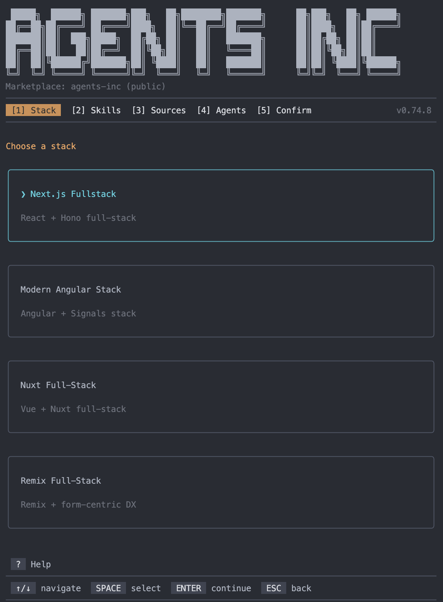
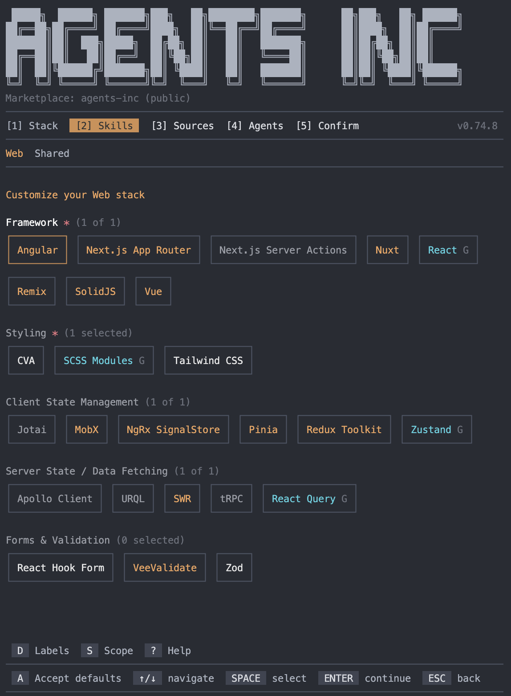
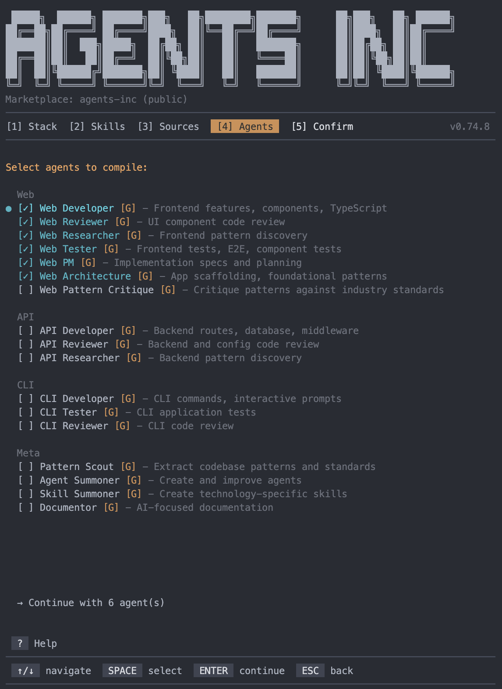

<p align="center">
  
</p>

# Agents Inc

An agent composition framework for [Claude Code](https://docs.anthropic.com/en/docs/claude-code). Compose specialized subagents from atomic skills:

1. Select a stack or start from scratch
2. Select your skills
3. Select your subagents
4. Customize per skill and subagent:
   - **Mode** plugin (managed) or eject (full control)
   - **Scope** global (all projects) or project (local) — keep meta agents global, send domain agents project-side when you work across frameworks
   - **Loading** preloaded (SKILL.md always loaded) or dynamic (loaded via agent content)
5. Map skills to subagents in the strictly-typed `config.ts`
6. Compile

<br />

[](https://www.typescriptlang.org/)
[](./LICENSE)

<p align="center">
  
</p>

## Getting Started

```bash
npx @agents-inc/cli init
```

<p align="center">
  
</p>

Choose from 16 pre-built stacks or start from scratch. Stacks pre-select skills and agents for common tech combinations.

| Stack                        | Technologies                                                 |
| ---------------------------- | ------------------------------------------------------------ |
| `nextjs-fullstack`           | Next.js + React + Hono + Drizzle + Better Auth + Zustand     |
| `nextjs-t3-stack`            | Next.js + tRPC + Prisma + NextAuth + Tailwind                |
| `nextjs-supabase-fullstack`  | Next.js + Supabase + Drizzle + Better Auth                   |
| `nextjs-turborepo-fullstack` | Next.js + Turborepo + pnpm Workspaces + Hono + Drizzle       |
| `nextjs-ai-saas`             | Next.js + Vercel AI + Anthropic + Drizzle + Pinecone         |
| `nextjs-saas-starter`        | Next.js + Better Auth + Stripe + Drizzle + Resend + PostHog  |
| `react-old-school`           | React + Redux Toolkit + SCSS Modules + Vite + Vitest         |
| `react-hono-fullstack`       | React + Vite + Hono + Drizzle + Better Auth                  |
| `remix-fullstack`            | Remix + Hono + Drizzle + Better Auth                         |
| `sveltekit-fullstack`        | SvelteKit + Hono + Drizzle + Better Auth                     |
| `solidjs-fullstack`          | SolidJS + Hono + Drizzle + Better Auth + Vitest              |
| `astro-content-fullstack`    | Astro + Hono + Drizzle                                       |
| `vue-modern-fullstack`       | Vue 3 + Pinia + Hono + Drizzle + Better Auth                 |
| `nuxt-fullstack`             | Nuxt + Hono + Drizzle + Better Auth                          |
| `angular-modern-fullstack`   | Angular + NgRx + Hono + Drizzle + Better Auth                |
| `expo-mobile-fullstack`      | Expo + React Native + Zustand + React Query + Hono + Drizzle |

<p align="center">
  
</p>

Add or remove skills from the interactive grid. Skills are organized by domain with framework-aware filtering.

<p align="center">
  
</p>

Choose which subagents to compile. Each agent is composed from the skills you selected.

After init, use `agentsinc edit` to change selections and `agentsinc compile` to rebuild agents.

## Guides

| Guide                                                                       | Description                                                          |
| --------------------------------------------------------------------------- | -------------------------------------------------------------------- |
| [Global-first setup](docs/guides/global-first-setup.md)                     | Why global scope is the right default and when to use project scope  |
| [Install modes](docs/guides/install-modes.md)                               | Plugin vs local install, global vs project scope                     |
| [Editing your config](docs/guides/editing-config.md)                        | Skill mappings, preloaded vs dynamic loading, and config structure   |
| [Customizing subagents](docs/guides/customizing-subagents.md)               | Eject and modify partials, templates, and skills                     |
| [Writing custom skills and subagents](docs/guides/writing-custom-skills.md) | Author skills and subagents from scratch or iterate on existing ones |
| [Importing third-party skills](docs/guides/importing-skills.md)             | Install skills from external repositories                            |
| [Creating a marketplace](docs/guides/creating-a-marketplace.md)             | Build a personal or org-level marketplace with curated skills        |
| [Using the codex-keeper subagent](docs/guides/using-codex-keeper.md)        | Generate and maintain AI-focused reference documentation             |

## Skills

150+ skills across 8 domains:

**Web:** React, Vue, Angular, Svelte, SolidJS, Next.js, Remix, Nuxt, SvelteKit, Astro, Qwik, Tailwind, SCSS Modules, Zustand, Redux, Pinia, Vitest, Playwright, Storybook, and more
**API:** Hono, Express, Fastify, NestJS, Elysia, Drizzle, Prisma, PostgreSQL, MongoDB, Redis, Stripe, and more
**AI:** Anthropic SDK, OpenAI SDK, Vercel AI SDK, LangChain, LlamaIndex, Pinecone, ChromaDB, and more
**Mobile:** React Native, Expo
**CLI:** Commander, oclif + Ink
**Infra:** Docker, GitHub Actions, Cloudflare Workers
**Shared:** Turborepo, ESLint + Prettier, Code Reviewing, Auth Security, and more
**Meta:** Research Methodology, CLI Reviewing

Browse the full catalog on the [Plugin Marketplace](https://github.com/agents-inc/skills).

## Subagents

| Category         | Subagents                                                          |
| ---------------- | ------------------------------------------------------------------ |
| Developers       | `web-developer` `api-developer` `cli-developer` `web-architecture` |
| Reviewers        | `web-reviewer` `api-reviewer` `cli-reviewer`                       |
| Testers          | `web-tester` `cli-tester`                                          |
| Researchers      | `web-researcher` `api-researcher`                                  |
| Planning         | `web-pm`                                                           |
| Pattern Analysis | `pattern-scout` `web-pattern-critique`                             |
| Documentation    | `codex-keeper`                                                     |
| Meta             | `skill-summoner` `agent-summoner` `convention-keeper`              |

Each subagent is composed from modular partials (role, workflow, output format) plus its assigned skills. Everything is ejectable.

## Commands

### Core

| Command   | Description                                                                 |
| --------- | --------------------------------------------------------------------------- |
| `init`    | Interactive setup wizard: pick a stack, customize skills, compile subagents |
| `edit`    | Modify skill selection via the interactive wizard                           |
| `compile` | Recompile subagents after changes                                           |
| `update`  | Pull latest skills from source                                              |
| `search`  | Search skills across all sources                                            |

### Customization

| Command           | Description                                                               |
| ----------------- | ------------------------------------------------------------------------- |
| `eject <type>`    | Export for customization (`agent-partials`, `templates`, `skills`, `all`) |
| `import skill`    | Import a skill from an external GitHub repository                         |

### Build

| Command             | Description                                    |
| ------------------- | ---------------------------------------------- |
| `build marketplace` | Generate `marketplace.json` from source skills |
| `build plugins`     | Build skill and agent plugins for distribution |

### Diagnostics

| Command     | Description                         |
| ----------- | ----------------------------------- |
| `doctor`    | Diagnose setup issues               |
| `list`      | Show installed skills and agents    |
| `validate`  | Validate config and skill structure |
| `uninstall` | Remove Agents Inc from your project |

Run `agentsinc --help` for full usage, or see the [full commands reference](./docs/reference/commands.md).

## Links

- [Plugin Marketplace](https://github.com/agents-inc/skills): browse and discover skills
- [Architecture Reference](./docs/reference/architecture.md): full system documentation

## License

MIT
